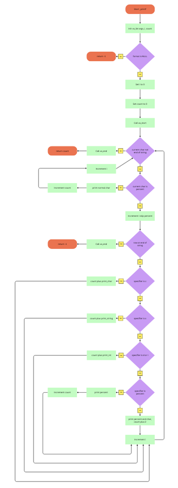

# ✅ _printf Project — Holberton School

**📌 Description**

*The _printf project aims to recreate a simplified version of the standard C library function printf.*

*The goals of this project are to practice:*

*Handling strings and formatted output*

*Using variadic functions (va_list)*

*Modular program design in C*

*Clean architecture and documentation*

*Teamwork and Git versioning*

*This implementation supports multiple format, each handled by a dedicated function.*

**🏗️ Supported Format Specifiers**  
```
| Specifier   | Description                          |
| ----------- | ------------------------------------ |
| `%c`        | Prints a single character            |
| `%s`        | Prints a string                      |
| `%d` / `%i` | Prints a signed integer in base 10   |
| '%%'        | Prints  percent '%'                  |
```


## 
**📁 Project Structure**
### unordered

* _printf.c
* _putchar.c
* main.h
* man_3_printf.3
* print_char.c
* print_int.c
* _print_percent.c
* _print_string.c
* README.md

## Flowchart project




## 🧩 File Descriptions
#### ✅ _printf.c

* Main entry point 
* Iterates through the format string
* Detects % characters

* Calls the appropriate function

* Returns the total printed character count

#### ✅ print_char.c

* Retrieves a character from va_list

* Prints it using _putchar

* Returns 1

#### ✅ print_string.c

* Prints a string character by character

* Handles NULL by printing (null)

#### ✅ print_int.c

* Converts a signed integer to decimal text

* Handles negative values

* Prints digits one by one

#### ✅ print_percent.c

* A direct call to _putchar('%') to print the character to standard output.

* Puts '%' sign before character or int 

#### ✅ _putchar.c

* Wrapper around the write system call

* Prints a single character

* Used by all print handlers

#### ✅ main.h

* Contains all prototypes, includes, and data structures

* Central header for the entire project

#### ✅ man_3_printf

* Manual page for the function

* Describes usage, behavior, and supported formats

## ⚙️ Compilation

To compile all source files:

        $ gcc -Wall -Werror -Wextra -pedantic -std=gnu89 -Wno-format *.c


✔ Follows Holberton requirements \
✔ Must compile with no warnings

Run the program:

        ./a.out

✅ Usage Example
```
#include "main.h"

int main(void)
{
    _printf("Display a percent sign: %%\n");
    _printf("Success rate: 100%% guaranteed!\n");

    return (0);
}

output:

Display a percent sign: %
Success rate: 100% guaranteed!
  
```

Return value:

* display a percent '%' sign on the sentence: 100% guaranteed!

## 🧰 Requirements

* OS: Ubuntu 20.04 LTS

* Compiler:  $ gcc -Wall -Werror -Wextra -pedantic -std=gnu89 -Wno-format *.c

* Allowed: va_args

* Code must be readable and understandable by the peers

## 📖 Man Page Summary

**Name**

        _printf — formatted output function


**Prototype**

        int _printf(const char *format, ...);


**Description**

Prints formatted output based on the supported format specifiers.

Return Value

Returns the number of printed characters.

Returns -1 on error.

**Supported Specifiers**

%c, %s, %d, %i, %

## Authors

Antoine Gousset : 
[Markdown Live Preview](https://markdownlivepreview.com/).

Djibril Niang :
[Markdown Live Preview](https://markdownlivepreview.com/).

